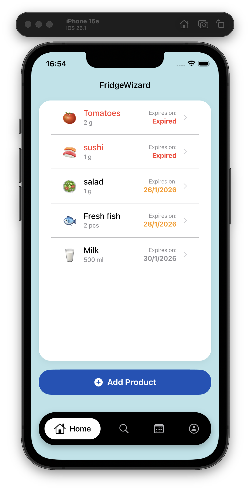
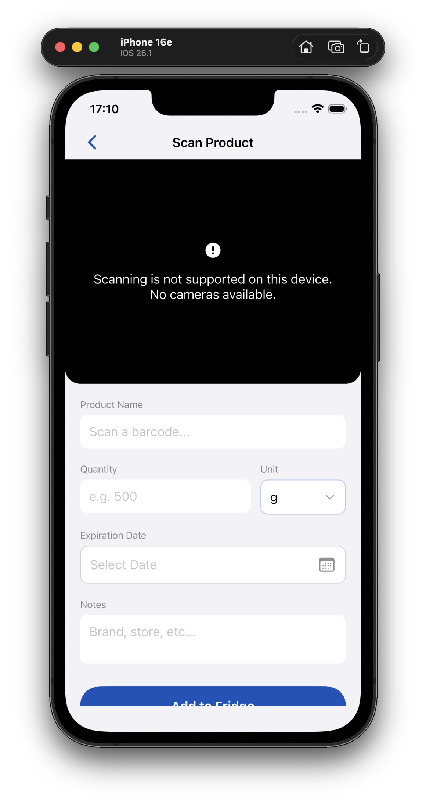
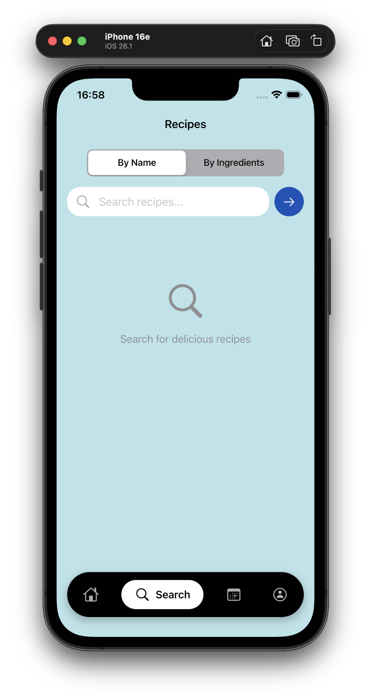
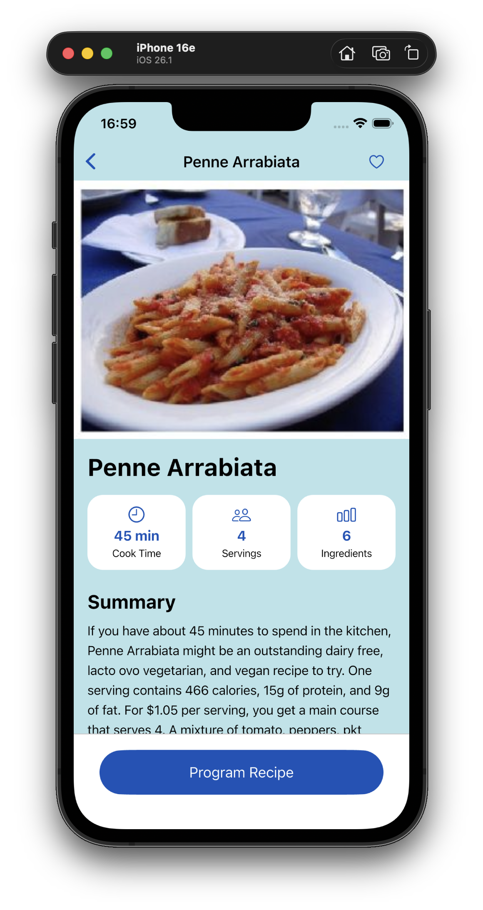
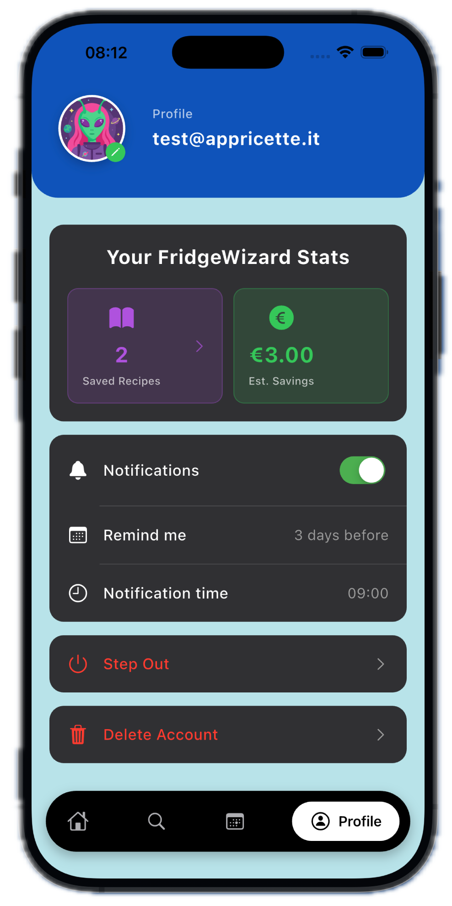
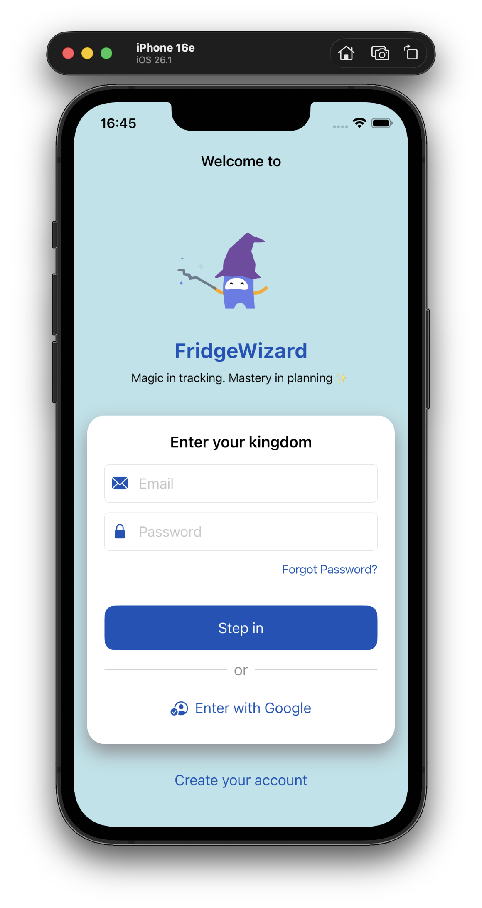

# 🧙‍♂️ FridgeWizard

**Magic in tracking. Mastery in planning ✨**

A modern Flutter application for smart fridge management and recipe discovery. Track your ingredients, get expiration reminders, and find recipes based on what you have!

[](https://flutter.dev)
[](https://firebase.google.com)
[](https://ai.google.dev)
[](LICENSE)

*Developed by: Matteo Delogu · Filippo Paris · Alberto Brignola*

---
## Table of Contents
01. 📜 [Overview](#-overview)
02. 📱 [Key Features](#-key-features)
03. 🚀 [Getting Started](#-getting-started)
04. 🛠 [Tech Stack](#-tech-stack)
05. 📁 [Project Structure](#-project-structure)
06. 🌍 [API Credits & Attribution](#-api-credits--attribution)
07. 🔐 [Security & Privacy](#-security--privacy)
08. 📸 [Visual Preview](#-visual-preview)
09. 📊 [Project Statistics](#-project-statistics)
10. 📄 [License & Usage Terms](#-license--usage-terms)
    
---

## 📜 Overview
FridgeWizard is a smart inventory management app designed to help users reduce food waste and shop more consciously. By streamlining product registration via barcode scanning, the app tracks quantities and expiration dates, sending timely alerts for items nearing shelf life.

Beyond simple tracking, FridgeWizard transforms inventory into inspiration: it suggests recipes based on expiring ingredients and syncs meal plans directly to the device calendar. With personalized statistics on consumption habits and a customizable user profile, FridgeWizard turns pantry management into an efficient, zero-waste routine.

## 📱 Key Features
### 🏠 Smart Fridge Management
- **Manual Entry**: Add products manually with all details
- **Barcode Scanning**: Scan product barcodes for instant information using OpenFoodFacts API
- **Expiration Tracking**: Dynamic color-coded alerts for expiring items
- **AI Translation**: Automatic product name translation and generic extraction via Gemini AI
- **Category Classification**: Smart ingredient categorization with AI-powered recognition
- **Detailed View**: Edit, update, or delete products with ease
- **Customizable Alerts**: User-defined expiration warning periods (1-14 days)

### 🔍 Recipe Discovery
- **Search by Name**: Find recipes using keywords from Spoonacular API
- **Search by Ingredients**: Get recipe suggestions based on your fridge contents
- **Smart Matching**: See how many ingredients you have vs. need for each recipe
- **Detailed Instructions**: Step-by-step cooking guides with images and timing
- **Nutritional Information**: Servings, cooking time, and ingredient lists

### 📅 Meal Planning
- **Recipe Calendar**: Plan your meals chronologically
- **Shopping List**: Automatically generated from planned recipes
- **Smart Sync**: Ingredients added to fridge are removed from shopping list
- **Quick Add**: Add shopping list items directly to fridge with pre-filled forms

### 📊 User Profile & Settings
- **Basic Statistic Dashboard**: Saved recipes and estimated savings (will be incremented)
- **Custom Notifications**: Push notifications for expiring items
- **Configurable Reminders**: Set expiration warnings (1 to 14 days before)
- **Avatar Selection**: Choose from 6 unique monster-themed avatars
- **User Profiles**: Sync data across devices with Firebase Authentication

### ⚙️ Personalization
- **Dynamic Color Coding**: Product cards change color based on expiration proximity
- **Theme Support**: Automatic dark/light mode switching (In Development)
- **User-Specific Settings**: Personalized notification preferences per account

### 🤖 AI Assistant (Coming Soon)
- Natural language product addition
- Conversational recipe search
- Smart suggestions based on fridge contents


## 🚀 Getting Started
### Prerequisites
- **Flutter SDK**: 3.0 or higher ([Install Guide](https://docs.flutter.dev/get-started/install))
- **Xcode** (for iOS development) or **Android Studio** (for Android)
- **Firebase Project**: Set up at [Firebase Console](https://console.firebase.google.com)
- **API Keys** (all free tier available):
  - Spoonacular API ([Get Free Key](https://spoonacular.com/food-api))
  - Google Gemini API ([Get Key](https://ai.google.dev))

### Installation

1. **Clone the repository**
   ```bash
   git clone https://github.com/yourusername/Project_App_Ricette_DIMA.git
   cd Project_App_Ricette_DIMA/app_ricette
   ```

2. **Install dependencies**
   ```bash
   flutter pub get
   ```

3. **Configure Firebase**
   - Create a new Firebase project at [Firebase Console](https://console.firebase.google.com)
   - Enable **Authentication** (Email/Password & Google)
   - Enable **Cloud Firestore** database
   - Download configuration files:
     - `google-services.json` (Android) → place in `android/app/`
     - `GoogleService-Info.plist` (iOS) → place in `ios/Runner/`
   - or use the FlutterFire CLI:
     ```bash
     dart pub global activate flutterfire_cli
     flutterfire configure
     ```

4. **Set up API Keys**
   
   Create `.env`:
   ```bash
   GEMINI_API_KEY=your_gemini_api_key_here
   GEMINI_MODEL=gemini-2.5-flash
   
    SPOONACULAR_API_KEY=your_spoonacular_api_key_here
   ```

   > ⚠️ **Note**: Never commit API keys to version control. Add `.env` to `.gitignore`

5. **Run the app**
   ```bash
   # Check connected devices
   flutter devices
   
   # Run
   flutter run
   ```


## 🛠 Tech Stack

### Frontend
- **Flutter/Dart** - Cross-platform UI framework (iOS & Android)
- **Cupertino Widgets** - Native iOS-style design components

### Backend & Services
- **Firebase Authentication** - Email/Password and Google Sign-In with OAuth 2.0
- **Cloud Firestore** - Real-time NoSQL database for user data synchronization
- **Google Gemini AI** - Product name translation, generic extraction, and categorization
- **Spoonacular API** - Comprehensive recipe database (640,000+ recipes)
- **OpenFoodFacts API** - Open product barcode database (2M+ products)

### Key Packages
```yaml
dependencies:
  # Firebase & Authentication
  firebase_core: ^2.24.2
  firebase_auth: ^4.16.0
  cloud_firestore: ^4.14.0
  google_sign_in: ^6.2.1
  
  # Barcode & Camera
  mobile_scanner: ^5.2.3
  
  # Networking
  http: ^1.1.0

 # Permissions
  permission_handler: ^11.3.0
  
  # Local Storage
  shared_preferences: ^2.2.2

  # Notifications
  flutter_local_notifications: ^18.0.1
  timezone: ^0.9.4
  workmanager: ^0.9.0

  # Calendar
  device_calendar: ^4.3.2

  # UI & Animations
  lottie: ^3.1.0

  # Testing
  fake_cloud_firestore: ^3.0.0
  firebase_auth_mocks: ^0.14.0 
  
  # AI Integration
  google_generative_ai: ^0.4.6
```


## 📁 Project Structure

```
app_ricette/
├── lib/
│   ├── models/                # Data models
│   │   ├── ingredient.dart       # Product/ingredient model
│   │   ├── recipe.dart           # Recipe data model
│   │   ├── planned_meal.dart     # Meal planning
|   |   ├── category_price.dart   # Prices categorization
│   │   └── category_mapper.dart  # Ingredient categorization logic
│   │ 
│   │
│   ├── screens/                      # UI screens
│   │   ├── auth_page.dart                # Authentication state handler
│   │   ├── login_page.dart               # Login & registration UI
│   │   ├── home_page.dart                # Main fridge view with navigation
│   │   ├── barcode_page.dart             # Barcode scanning interface
│   │   ├── add_product_manual_page.dart  # Manual product entry
│   │   ├── product_page.dart             # Product detail & edit view
│   │   ├── recipes_page.dart             # Recipe search interface
│   │   ├── show_recipe.dart              # Recipe detail view
│   │   ├── missing_ingredient_page.dart  # Missing ingredients for recipes
│   │   ├── settings_page.dart            # User profile & settings
│   │   ├── saved_recipes_page.dart       # Saved recipes list
│   │   └── plan_page.dart                # Meal planning 
│   │
│   ├── services/                  # Business logic & API integration
│   │   ├── FirestoreService.dart     # Firebase CRUD operations
│   │   ├── BarcodeService.dart       # OpenFoodFacts API integration
│   │   ├── RecipesService.dart       # Spoonacular API wrapper
│   │   ├── gemini_service.dart       # Gemini AI integration
│   │   ├── meal_planner_service.dart # Meal planning logic
│   │   └── notification_service.dart # Push notifications (TBD)
│   │
│   ├── utils/                     # Utility functions & constants
|   |   ├── app_events.dart         # Notifier
│   │   ├── categories.dart         # Ingredient categories
│   │   ├── is_tablet.dart          # Device type detection
│   │   └── my_theme_data.dart      # Theme data & styles
│   │
│   ├── widgets/                  # Reusable UI components
│   │   └── nav_bar.dart          # Bottom navigation bar
│   │
│   ├── firebase_options.dart      # Firebase configuration
│   └── main.dart                  # App entry point
│
├── assets/
│   ├── avatars/                   # User avatar images (6 monsters)
│   │   ├── alien.png
│   │   ├── mummy.png
│   │   ├── vampire.png
│   │   ├── wolf.png
│   │   ├── yeti.png
│   │   └── zombie.png
│   └── lottie/                    # Animation files
│       └── magic.json
│
├── android/                      # Android-specific configuration
├── ios/                          # iOS-specific configuration
└── pubspec.yaml                  # Dependencies & assets
```

## 🔐 Security & Privacy

- ✅ **Firebase Authentication** for secure login (OAuth 2.0)
- ✅ **User data isolation** - each user's data is separated by UID
- ✅ **No sensitive data stored locally** - API keys in separate file (gitignored)
- ✅ **HTTPS-only communications** - all API calls are encrypted
- ✅ **Barcode processing** - handled locally on device
- ✅ **Firestore security rules** - read/write only for authenticated users
- ✅ **GDPR Compliance** - user data handled per regulations


## 🌍 API Credits & Attribution

- **Spoonacular** - Recipe data and search ([spoonacular.com](https://spoonacular.com))
  - 640,000+ recipes with detailed instructions
  - Free tier: 150 requests/day
- **OpenFoodFacts** - Product barcode database ([openfoodfacts.org](https://world.openfoodfacts.org))
  - Open database with 2M+ products
  - Completely free and open-source
- **Google Gemini** - AI-powered text processing ([ai.google.dev](https://ai.google.dev))
  - Product name translation and extraction
  - Category classification

## 📸 Visual Preview

| Home Screen                   | Barcode Scanner                           | Recipe Search                            |
|-------------------------------|-------------------------------------------|------------------------------------------|
|  |  |  |

| Recipe Details                           | Profile & Settings | Login |
|------------------------------------------|-------------------|-------|
|  |  |  |

---
<!--
## 🚧 Roadmap & Planned Features

### 🎯 Short-term Goals 
- [ ] **Statistics Dashboard**
    - Consumption analytics

- [ ] **AI Assistant**
    - Natural language product addition
    - Conversational recipe search
    - Smart suggestions based on expiring items

### 🌟 Long-term Goals
- [ ] Social features (share recipes, shopping lists)
- [ ] Multi-language support 
- [ ] Widget support for Android
- [ ] Nutrition tracking and dietary preferences
-->

## 📊 Project Statistics

- **Lines of Code**: ~10000
- **Screens**: 10+
- **API Integrations**: 3 (Firebase, Spoonacular, OpenFoodFacts, Gemini)
- **Device plugins**: 4 (Camera, Calendar, Notifications, SharedPreferences)
- **Supported Platforms**: iOS, Android
- **Language**: Dart
- **Framework**: Flutter 3.0+
  

## 📄 License & Usage Terms
FridgeWizard © 2026 All Rights Reserved. 

No part of this project may be reproduced or used without permission.
This project is developed for academic purposes as part of the **DIMA** (Design and Implementation of Mobile Applications) course at Politecnico di Milano.

**Made with ❤️ and Flutter**
